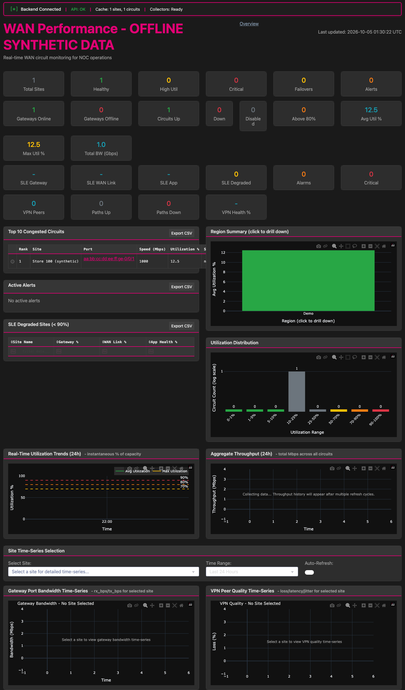
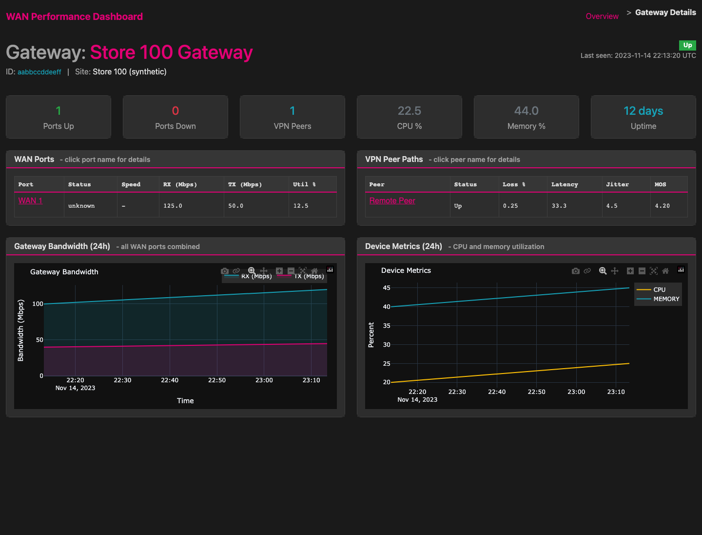
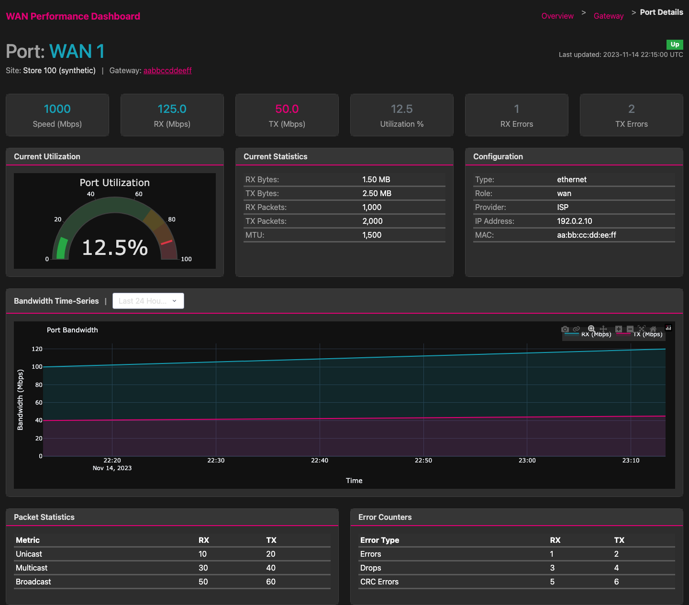
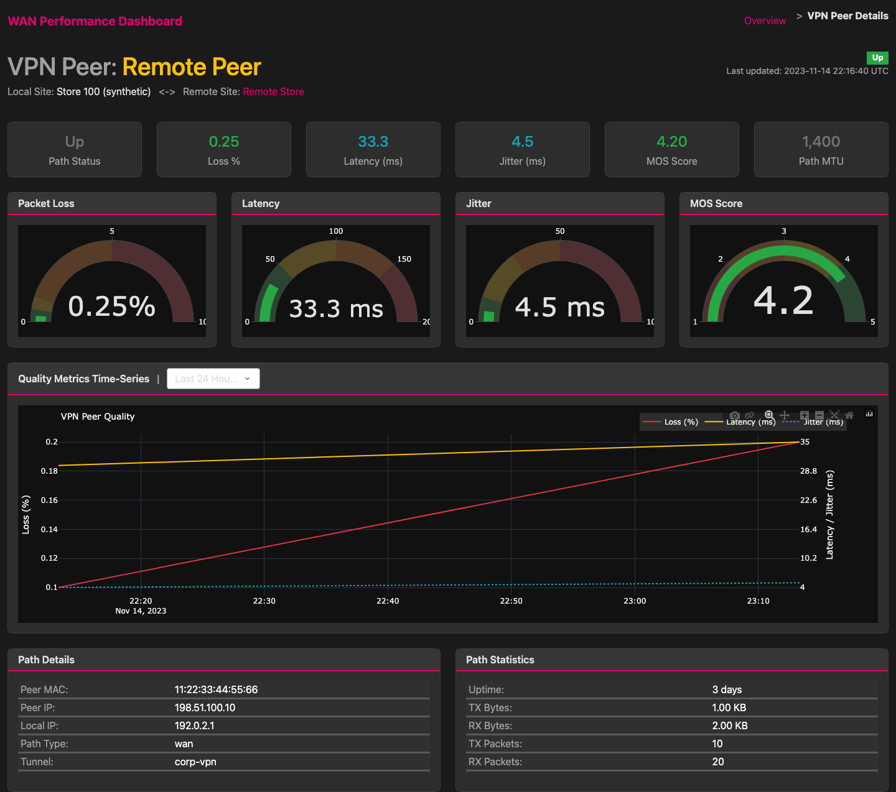

# Application screens

These screenshots show the real Dash application using synthetic test fixtures.
They are not designs, generated mockups, or live Mist/Snowflake measurements.
The fixture timestamps are deliberately historical. No API or database clients
are created, and no background collection workers run.

## Reproduce locally

Install the development dependencies as described in
[the operating guide](operations.md#offline-tests-and-dependency-updates), activate
`.venv`, and run from the repository root:

```bash
python -m tests.fixtures.offline_dashboard
```

Open `http://127.0.0.1:8051`. Stop the preview with Ctrl+C.
This test-only launcher uses the production dashboard, overview calculations,
and the same detail fixtures used by the automated tests.

The preview disables the production CDN stylesheet. For the Bootstrap layout in
these captures, a public Darkly theme was downloaded once into the ignored
`data/cache/offline-assets/darkly.css` directory, before capture:

```bash
mkdir -p data/cache/offline-assets
curl --fail --location https://cdn.jsdelivr.net/npm/bootswatch@5.3.6/dist/darkly/bootstrap.min.css \
  --output data/cache/offline-assets/darkly.css
```

After that preparation, the preview and capture need only localhost. Without the
optional stylesheet the application still runs, using its built-in custom CSS.
Before capturing, remove the theme's remote font import to use local system fonts:

```bash
python -c "from pathlib import Path; import re; path = Path('data/cache/offline-assets/darkly.css'); path.write_text(re.sub(r'@import url\([^;]+;', '', path.read_text()))"
```

Captures used Chromium at a 1440-by-1100 viewport, with every non-localhost request
blocked. All four routes completed without browser errors. The overview's
connection indicators describe the fixture-backed provider, not validated service
connectivity. Empty history panels reflect the small synthetic dataset.

## Overview

Route: `/`. Site and circuit summaries are calculated by the real data provider.



## Gateway

Route: `/gateway/aabbccddeeff?site_id=11111111-1111-1111-1111-111111111111`.
Inspect gateway health, WAN ports, and peer paths.



## WAN port

Route: `/port/11111111-1111-1111-1111-111111111111/ge-0%2F0%2F1?gateway_id=aabbccddeeff`.
Inspect utilization and receive/transmit bandwidth.



## VPN peer

Route: `/vpn/11111111-1111-1111-1111-111111111111/11%3A22%3A33%3A44%3A55%3A66`.
Inspect packet loss, latency, jitter, and tunnel details.


